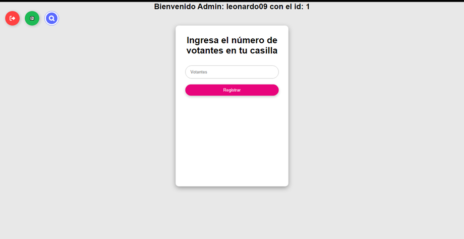
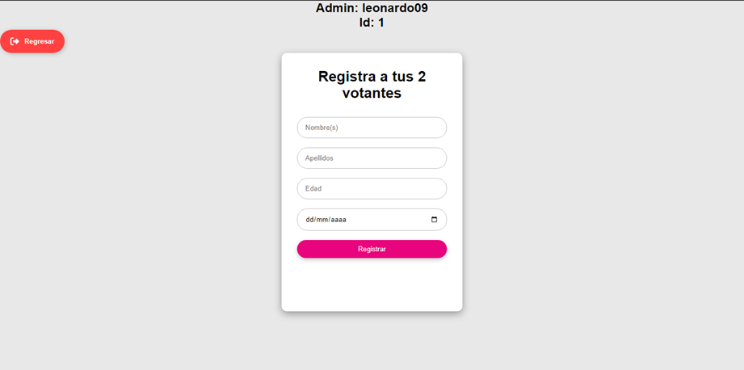
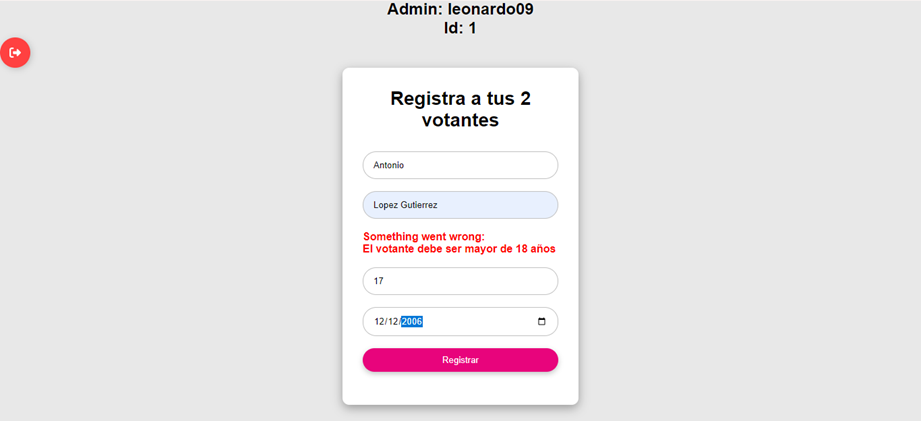
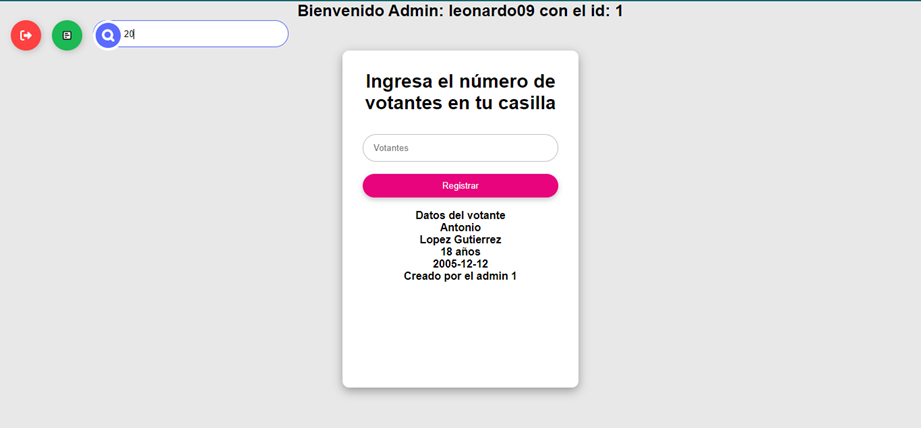
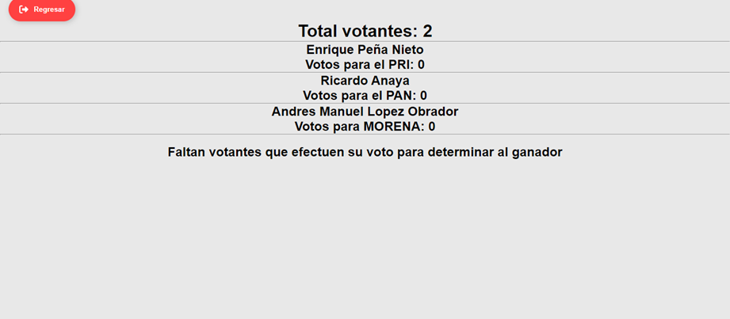
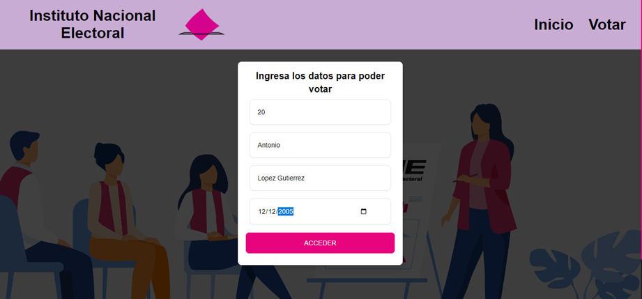
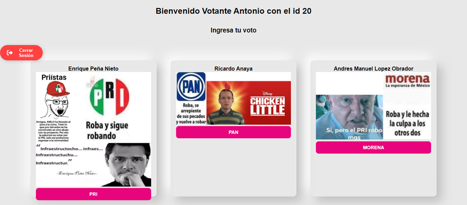
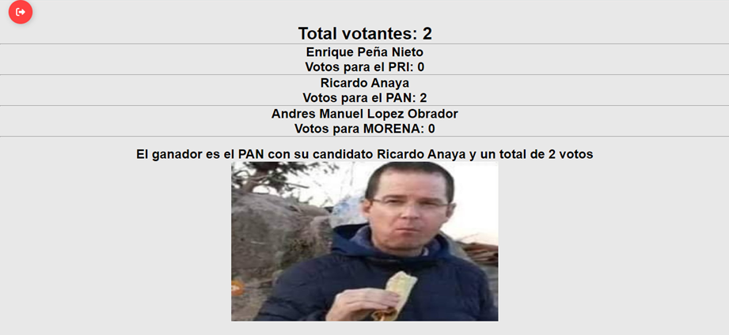

# Instituto Nacional Electoral 

## By: Leonardo Reyes Martínez, Aplicación web desarrollada en Java para simular el conteo de votos para las elecciones del INE.

- Para ingresar a la aplicación es necesario ingresar usuario y contraseña (dos tipos de usuarios, administrador y votante). El usuario tiene 5 intentos posibles para acceder a la aplicación:

- En el caso de que el usuario agote sus 5 intentos, se bloquea la aplicación:

- Dashboard del Admin: El administrador es el único que puede iniciar el sistema.
 - Formulario para ingresar el número de votantes:

- Registra el número de votantes introducido previamente:

- Para registrar a un votante es necesario su nombre, apellidos, edad y fecha de nacimiento, considerando que si no es mayor a 18 años, no puede ser registrado:
 
- Una vez que se ingresó al sistema el administrador ingresa el número de votantes en su casilla, únicamente el número de votantes seleccionados por el administrador son los que podrán efectuar su voto.  En caso de que quiera ingresar mas votantes, le arrojara este error: 	
 
- El administrador es el único que puede consultar los datos de los votantes que registró

- El administrador es el único que puede consultar los resultados de las votaciones, partido y candidato ganador, mostrar si existe empate, cantidad de votos por partido y el total de los votantes:

- El votante para poder ingresar y efectuar su voto deberá ingresar su id, nombre completo y fecha de nacimiento:

- El votante puede seleccionar entre tres partidos políticos, PRI, PAN Y MORENA, cada uno con su respectivo candidato:

- Un votante que ya efectúo su voto no podrá volver a realizarlo:
Hasta que el número de votantes totales coincida con la suma total de los votos, determina el ganador: 

